# Movie Ticket Booking System 🎟️

This is a **Movie Ticket Booking System** built using **Core PHP, MySQL, HTML, CSS, JavaScript, jQuery, and Bootstrap**. 
It allows users to book movie tickets online, view seat availability, and get receipts after successful payment.

## Features 🚀
- User Registration & Login
- View Movie Listings
- Select Show Timing & Seats
- Razorpay Payment Gateway Integration
- Auto Ticket Generation (PDF/HTML)
- Admin Panel for Managing Movies & Shows
- Responsive UI (Bootstrap)

## Project Structure 📂
```
project/
├── admin/
├── booking.php
├── connection.php
├── contact-us.php
├── database/
├── img/
├── includes/   
├── index.php
├── lib/
├── login.php
├── payment_success.php
├── pgResponse.php
├── reciept.php
├── schedule.php
├── scripts/
├── signup.php
├── style/
├── TxnStatus.php
├── userlogout.php
├── vendor/
├── verify.php
└── _config.yml

```

## Technologies Used 🛠️
- PHP (Core PHP)
- MySQL Database
- HTML5, CSS3
- JavaScript, jQuery
- Bootstrap 5
- Razorpay API (for payments)

## Setup Instructions ⚙️
1. Clone the repository:
   ```bash
   git clone git@github.com:sandipmk/movie_ticket_booking.git
   ```
2. Import `database/cinema_db.sql` to your MySQL.
3. Update Razorpay API keys in `pgResponse.php`.
4. Run the project on your local server (XAMPP/WAMP).

## Admin Login (Demo)
- **URL**: `/admin/login.php`
- **Username**: admin
- **Password**: 123

## Screenshots 📸
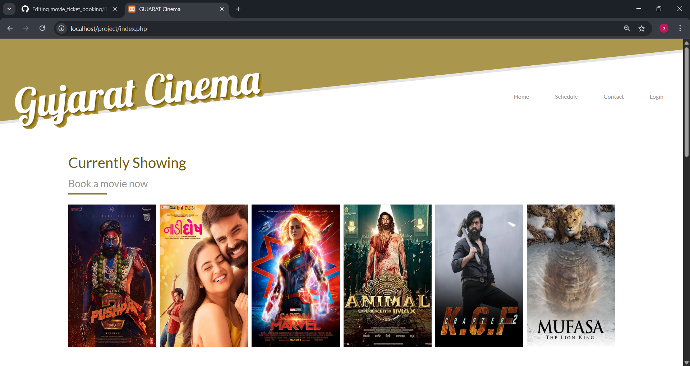

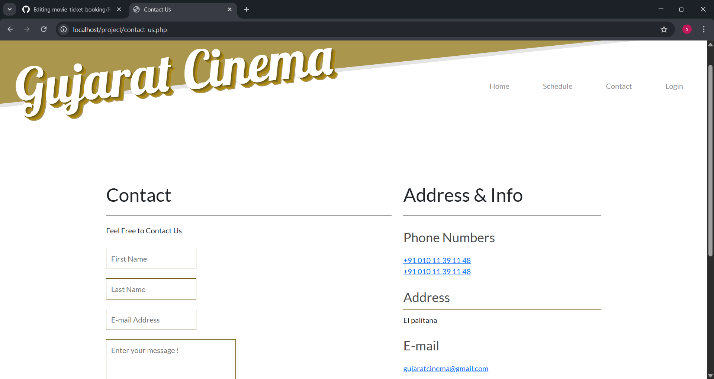
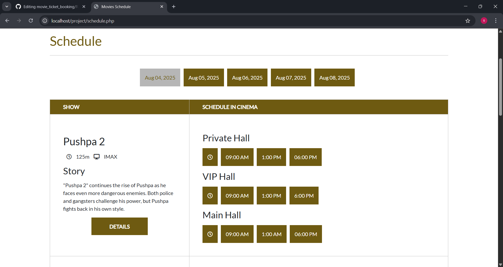

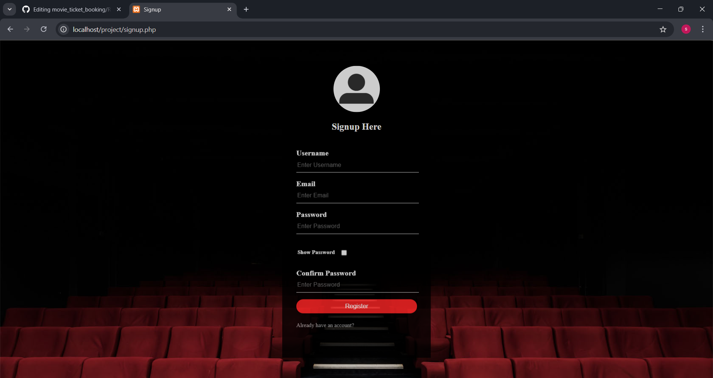
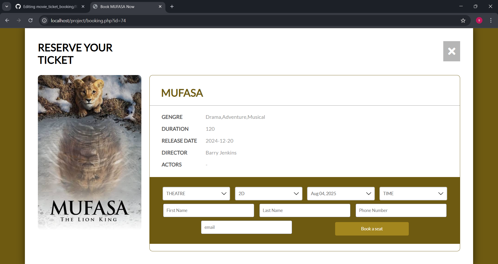
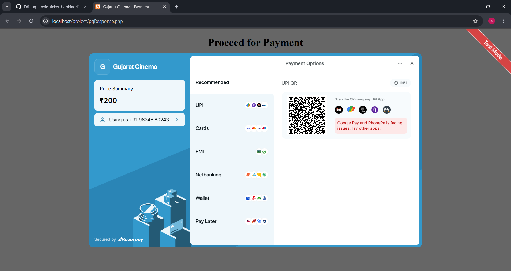
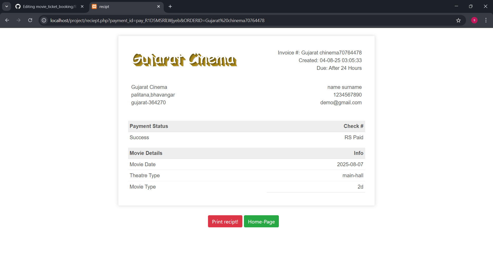

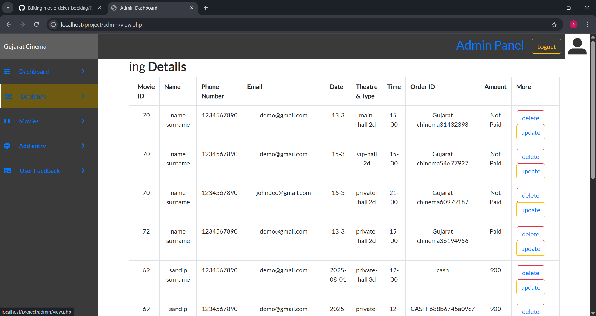
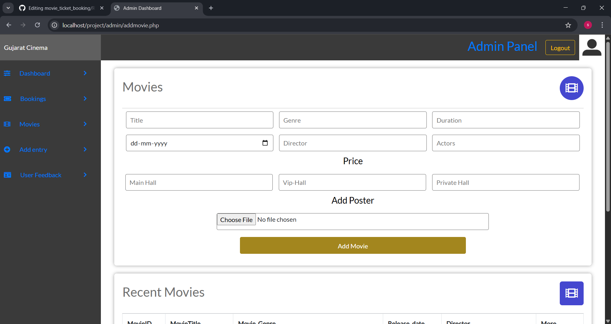
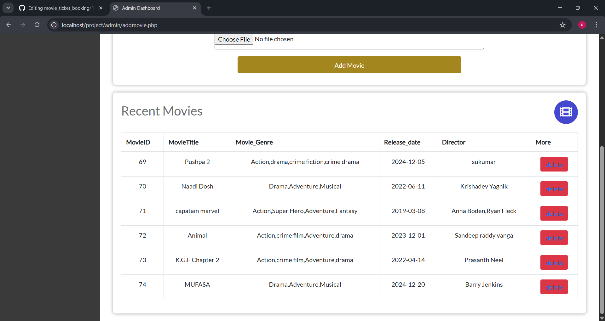
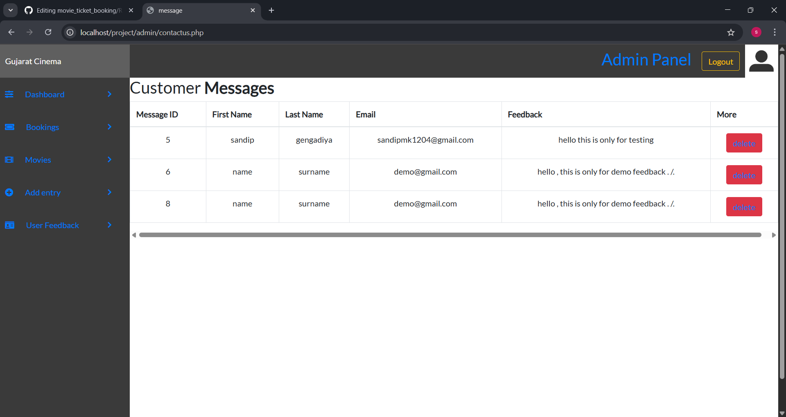


..

## License 📄
This project is for educational purposes only.

## Badges


## source code 
-given in the master branch...
